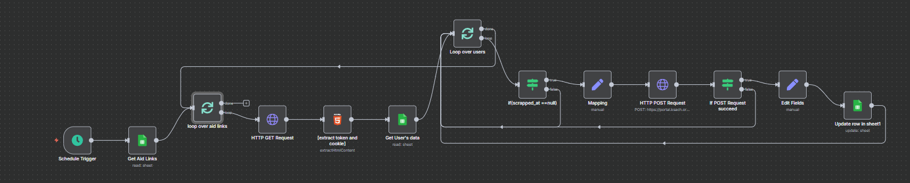

# Gaza Madad Flow Workflow Automation

## Overview

**Gaza Madad Flow** is a humanitarian aid registration automation tool designed for Gaza's emergency situations, particularly following the war in October 2023. It simplifies the registration process for citizens needing aid by allowing them to submit their information once, which is then automatically processed and forwarded to multiple aid platforms. This workflow leverages tools like Google Sheets, Google Forms, and n8n to streamline data collection, validation, and submission.

---
HAHAHA
I'm AYAYAYAYAYAYAYAYAYAYAYAYAYAYAYAYAYAYAYAYA
## Features

- **Unified Data Entry**: Users fill out a single form for aid registration.
- **Multi-Platform Registration**: The system automatically submits the collected data to various humanitarian aid platforms.
- **Real-time Processing**: It fetches, processes, and submits data in real-time using n8n automation.
- **Data Mapping**: Ensures correct data formatting and submission based on each platform’s unique fields.
- **Displacement & War-Related Information**: Handles specific data related to Gaza’s conflict, such as housing damage, displacement status, and loss of family members.
- **Support for Low Connectivity**: Works well in low-resource environments with limited internet access.

---

## Workflow Diagram

---

## Tools and Technologies

- **n8n**: Workflow automation platform used to automate data extraction, processing, and submission.
- **Google Sheets**: Used as a central data store for aid registration information.
- **Google Forms**: The front-end tool for collecting registration data.
- **Browserless**: Used for web scraping and interacting with aid platform forms.

---

## Workflow Details

1. **Data Collection**: The process begins with collecting user data via Google Forms.
2. **Data Storage**: Data is saved in Google Sheets for further processing.
3. **Trigger Event**: The workflow is triggered by new data added to the Google Sheet.
4. **Aid Link Retrieval**: The system retrieves aid platform links from a separate sheet.
5. **Looping Through Aid Links**: It scrapes the platform pages and maps citizen data to the correct fields.
6. **Data Mapping and Processing**: Fields like full name, ID, marital status, and others are mapped and formatted according to the aid form's requirements.
7. **Form Submission**: Data is automatically filled into the aid platform form and submitted.
8. **Result Handling**: The system checks the submission result, handles errors, and logs the outcome in the Google Sheet.

---

## Future Improvements

- **Multi-Platform Support**: Expanding the system to support more aid platforms.
- **AI Integration**: Using AI to help prioritize urgent cases and automate decision-making.
- **Scalability**: Adapting the system to work globally for various regions affected by crises.

---

## Acknowledgments

This project was developed by:
- **Aya Nabil Alharazin**
- **Maryam Refaa Skaik**
- **Rania Raid Kashkask**
- **Misk Saad Ashour**
- **Alaa Shareef Yousef**

Supervised by **Eng. Mohammed El Agha**
